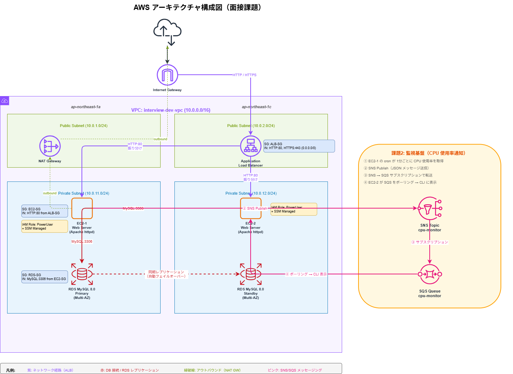
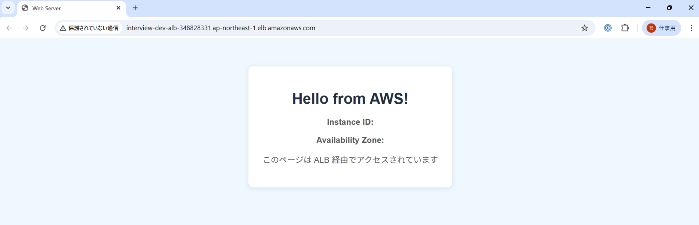
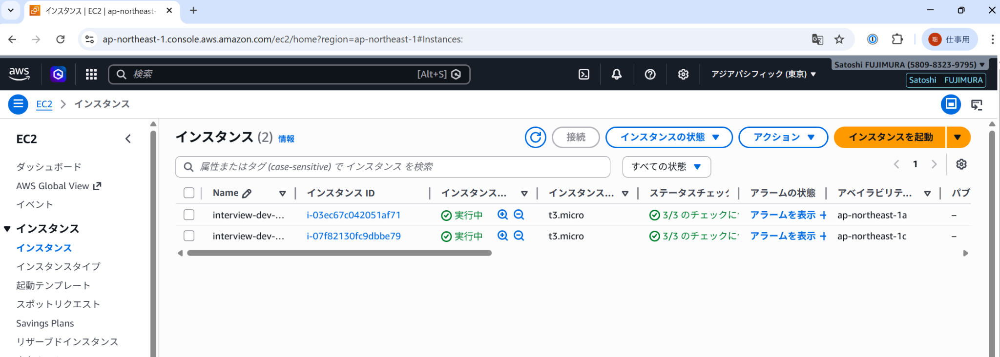
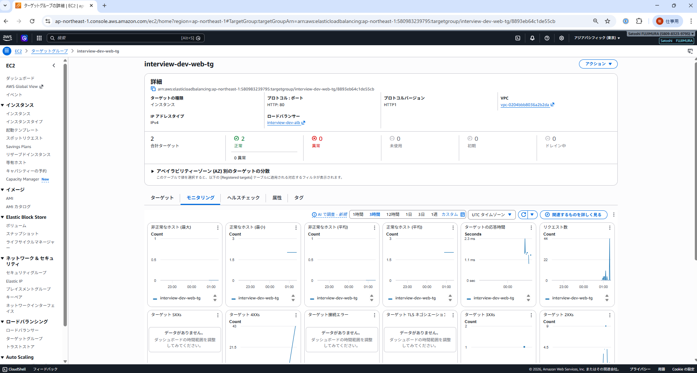

# AWS 3層 Web アーキテクチャ（Terraform）

AWS の代表的な 3層 Web アーキテクチャを Terraform で実装した学習・演習リポジトリです。
VPC・ALB・EC2・RDS・SNS/SQS を Terraform でコード化し、実際にデプロイして動作確認済みです。

---

## 目的

- Terraform を使って AWS の代表的な 3層 Web アーキテクチャを構築する
- セキュリティ・可用性・コスト最適化の観点を意識した設計を実践する
- インフラ構築から運用設計までの一連の流れを習得する

---

## 想定利用シーン

| シーン | 内容 |
|--------|------|
| ポートフォリオ | 実デプロイ済みの AWS 構成として提示 |
| 運用補助業務の出発点 | 監視・障害対応 Runbook の追加土台 |
| Terraform 学習の参考 | モジュール構成・変数管理・outputs の実例 |

---

## 使用技術

| カテゴリ | 技術・サービス |
|---------|--------------|
| IaC | Terraform（モジュール構成） |
| ネットワーク | Amazon VPC, パブリック/プライベートサブネット, NAT Gateway |
| 負荷分散 | Application Load Balancer（ALB） |
| コンピューティング | EC2（t3.micro × 2, Apache, User Data） |
| データベース | RDS MySQL 8.0（Multi-AZ, db.t3.micro） |
| メッセージング | Amazon SNS, Amazon SQS |
| セキュリティ | IAM ロール, Security Group, NACL, VPC Flow Logs, EBS 暗号化 |
| 運用 | SSM Session Manager（SSH レス接続） |
| CI | GitHub Actions（terraform fmt / validate / plan） |

---

## アーキテクチャ構成図

```
インターネット
      │
  [ALB] ─── パブリックサブネット（AZ-a / AZ-c）
      │
  ┌───┴───┐
[EC2-1]  [EC2-2] ─── プライベートサブネット（AZ-a / AZ-c）
  │    Apache  │
  └───┬───┘
      │
 [RDS MySQL Multi-AZ] ─── プライベートサブネット（AZ-a / AZ-c）
```

### Part 2：メッセージングアーキテクチャ

```
[EC2-1] ─ cron 1分ごと ─→ [SNS Topic]
                                  │
                          [SQS Queue（サブスクリプション）]
                                  │
              [EC2-2] ─ ポーリング ─→ CLI 表示
```



> 編集可能ファイル: [docs/architecture.drawio](docs/architecture.drawio)

---

## できること

### Part 1：Web サーバーの冗長構成

- ALB の DNS 名にブラウザからアクセスすると **"Hello from AWS!"** が表示される
- ページをリロードすると、表示されるインスタンス ID・AZ が切り替わる（ラウンドロビン）
- EC2 に障害が発生しても ALB のヘルスチェックが自動で切り替える

### Part 2：非同期メッセージング

- EC2-1 が 1分ごとに CPU 使用率を SNS に送信（cron）
- SQS がバッファリングし、EC2-2 がポーリングして受信・表示
- SNS → SQS のサブスクリプションで送受信を疎結合に設計

---

## 工夫した点

### セキュリティ
- **EC2 をプライベートサブネットに配置**：ALB 経由のみアクセス可能（直接公開しない）
- **IAM ロール**：アクセスキー不要。EC2 にロールをアタッチして最小権限を実現
- **二層防御**：Security Group + NACL の 2 段階フィルタリング
- **VPC Flow Logs**：全ネットワークトラフィックを CloudWatch に記録
- **ストレージ暗号化**：EC2 EBS・RDS ストレージを `encrypted = true` で保護
- **SSM Session Manager**：SSH ポート(22)不要。コンソールから安全に接続

### 可用性
- **マルチ AZ 配置**：EC2・RDS を AZ-a / AZ-c に分散配置
- **RDS Multi-AZ**：スタンバイ自動切替（フェイルオーバー約 60 秒）
- **ALB ヘルスチェック**：異常な EC2 へのトラフィックを自動停止

### Terraform 設計
- **モジュール構成**：vpc / alb / ec2 / rds / monitoring に分割して再利用可能
- **変数管理**：`variables.tf` で環境差分を吸収、`terraform.tfvars.example` で設定を明示
- **outputs**：ALB DNS・EC2 ID・RDS エンドポイントを出力して動作確認を容易に
- **CI 連携**：GitHub Actions で `fmt` / `validate` / `plan` を自動実行

---

## セキュリティ配慮

### 実装済み

| 対策 | 内容 |
|------|------|
| ネットワーク分離 | Public/Private サブネット分離。EC2・RDS はプライベートに配置 |
| 最小権限 SG | EC2 は ALB からの HTTP(80) のみ。RDS は EC2 からの MySQL(3306) のみ |
| 暗号化 | EBS・RDS ストレージを暗号化 |
| IAM ロール | アクセスキー不使用。ロールで最小権限を実現 |
| VPC Flow Logs | トラフィックログを CloudWatch に保存 |
| SSM Session Manager | SSH(22) ポートなしでコンソール接続 |

### 追加で検討すべき対策

詳細: [docs/security.md](docs/security.md)

| 優先度 | 対策 |
|--------|------|
| 高 | HTTPS 化（ACM + ALB リスナー）、CloudTrail、Secrets Manager |
| 中 | AWS WAF、GuardDuty |
| 低 | AWS Config、Security Hub |

---

## 今後の改善案

詳細: [docs/availability.md](docs/availability.md)

| 改善項目 | 内容 |
|---------|------|
| Auto Scaling Group | EC2 台数を負荷に応じて自動調整（最小 2 / 最大 6） |
| マルチ AZ NAT Gateway | NAT GW の単一障害点を排除 |
| CloudWatch アラーム | CPU・ALB 5xx・RDS 監視 + SNS 通知 |
| HTTPS 化 | ACM で証明書取得、ALB に HTTPS リスナー追加 |
| Secrets Manager | DB パスワードをコード管理から Secrets Manager に移行 |

---

## 構成ファイル

```
.
├── terraform/
│   ├── main.tf                    # モジュール呼び出し・全体設定
│   ├── variables.tf               # 入力変数定義
│   ├── outputs.tf                 # 出力値定義
│   ├── terraform.tfvars.example   # 設定例（コピーして使用）
│   └── modules/
│       ├── vpc/       # VPC・サブネット・NAT GW・Flow Logs
│       ├── alb/       # Application Load Balancer
│       ├── ec2/       # EC2 × 2台・IAM ロール・User Data
│       ├── rds/       # RDS MySQL Multi-AZ
│       └── monitoring/# SNS・SQS（Part 2）
├── scripts/
│   └── sqs_poller.sh  # SQS ポーリングスクリプト（Part 2 EC2-B 用）
└── docs/
    ├── architecture.drawio  # 構成図
    ├── security.md          # セキュリティ対策詳細
    ├── availability.md      # 可用性向上の追加構成
    ├── guide.md             # デプロイ実演ガイド
    └── screenshots/         # 動作確認スクリーンショット
```

---

## セットアップ手順

### 前提条件

- AWS CLI インストール・設定済み
- Terraform インストール済み（`terraform version` で確認）

### Step 1: 事前準備（5分）

```bash
git clone https://github.com/satoshif1977/terraform-3tier-webapp.git
cd terraform-3tier-webapp/terraform

cp terraform.tfvars.example terraform.tfvars
# terraform.tfvars を編集して db_password を設定
```

### Step 2: 初期化・確認（5分）

```bash
terraform init
terraform plan
# 約 42 リソースが作成予定として表示されることを確認
```

### Step 3: デプロイ（約 15〜20分）

```bash
terraform apply
# "yes" を入力して実行
# ※ RDS Multi-AZ の作成に 10〜15 分かかります
```

### Step 4: 動作確認

```bash
# ALB の DNS 名を確認してブラウザでアクセス
terraform output alb_dns_name
# http://<alb_dns_name> → "Hello from AWS!" が表示されれば成功
# リロードでインスタンス ID・AZ が切り替われば ALB ラウンドロビン動作確認 OK
```

### Step 5: 後片付け（重要）

```bash
terraform destroy
# "yes" を入力
# ⚠️ 使い終わったら必ず実行してください（放置すると課金が続きます）
```

---

## 推定コスト（東京リージョン / 1時間）

| リソース | コスト/時間 |
|---------|-----------|
| EC2 t3.micro × 2 | $0.027 |
| RDS db.t3.micro Multi-AZ | $0.040 |
| ALB | $0.024 |
| NAT Gateway | $0.062 |
| **合計** | **約 $0.15/時間（約 22円）** |

> 丸 1 日動かしても約 530 円。動作確認後は `terraform destroy` で即削除推奨。

---

## 動作確認スクリーンショット

### terraform apply 完了


ALB・EC2・RDS・SNS・SQS を含む全リソースのデプロイ完了。

### Hello from AWS!（ALB 経由でアクセス成功）



ALB の DNS 名にブラウザでアクセスし、EC2 からレスポンスが返ってきた画面。

### EC2 インスタンス 2台 実行中



AZ-a / AZ-c に 2台が正常稼働中。

### ターゲットグループ モニタリング



ALB のターゲットグループにリクエストが分散されている様子。

### RDS コンソール（利用可能・Multi-AZ 有効）


db.t3.micro・Multi-AZ 有効・VPC 内プライベートサブネットに配置。
